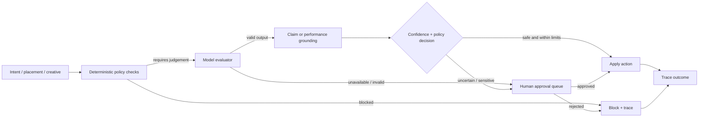

# GuardrailBidder

GuardrailBidder is a **guardrailed agent prototype for conversational advertising workflows**. It explores a simple question: if an AI system can score commercial intent, propose bids, generate creatives, and pause poor-performing placements, where should deterministic policy checks, model-based judgements, external evidence, and human approval sit in the action path?

The project was built as a demo/prototype rather than a production ad platform. It is useful as an example of **human-in-the-loop agent supervision**, but its heuristic fallbacks and model judges are not calibrated safety guarantees.

## What it demonstrates

A proposed action passes through several distinct controls instead of relying on one model call:

- **Spend controls** - per-placement caps, cumulative budget ceilings, and spike escalation.
- **Creative controls** - deterministic blocked-term checks followed by model-based review.
- **Claim grounding** - factual/performance claims can be checked against live search evidence.
- **Waste controls** - low-ROAS placements can be paused or escalated for review.
- **Human approval** - deferred actions are materialized as explicit approval items rather than silently executed.
- **Decision traces** - policy decisions are recorded and can optionally be mirrored to Overmind.
- **MCP exposure** - the same supervised actions can be called through an MCP server and Skybridge UI.

## Key components

| File | Responsibility |
| --- | --- |
| [`guardrailbidder/services/bidder.py`](guardrailbidder/services/bidder.py) | spend limits, escalation and bid decisions |
| [`guardrailbidder/services/safety_judge.py`](guardrailbidder/services/safety_judge.py) | policy-first creative review, schema-validated model output, conservative fallback path and claim verification |
| [`guardrailbidder/services/approval_executor.py`](guardrailbidder/services/approval_executor.py) | execution boundary between recommendation and approved action |
| [`guardrailbidder/services/supervisor.py`](guardrailbidder/services/supervisor.py) | supervision/trace recording |
| [`guardrailbidder/services/waste_detector.py`](guardrailbidder/services/waste_detector.py) | placement-performance guardrails |
| [`guardrailbidder/mcp_server.py`](guardrailbidder/mcp_server.py) | MCP tool boundary |
| [`tests/test_guardrail_edges.py`](tests/test_guardrail_edges.py) | edge-case policy behavior |
| [`tests/test_approval_executor.py`](tests/test_approval_executor.py) | approval/deferred-action behavior |
| [`tests/test_safety_judge.py`](tests/test_safety_judge.py) | judge parsing, schema validation and fail-closed fallback behavior |
| [`tests/test_llm_compat.py`](tests/test_llm_compat.py) | model-client compatibility/fallback behavior |

The TypeScript MCP app lives under [`skybridge__app/src`](skybridge__app/src). Generated frontend build output is intentionally not part of the maintained source tree.

## Decision flow



A useful property of this design is that **approval is an execution boundary**: creating a recommendation and committing spend/serving a creative/pausing a placement are separate operations. The creative judge also fails closed: if the model judge is unavailable or returns invalid structured output, deterministic checks may still block an explicit violation, but otherwise the creative is routed to `REVIEW` rather than automatically passing.

## Project structure

```text
guardrailbidder/
  app.py                 FastAPI API and demo orchestration
  config.py              runtime configuration
  mcp_server.py          MCP tool surface
  models.py              typed domain models
  state.py               in-memory demo state
  services/
    approval_executor.py
    bidder.py
    creative_agent.py
    intent_scorer.py
    safety_judge.py
    seeded_demo.py
    supervisor.py
    tavily_claims.py
    waste_detector.py
  web/                    lightweight browser console

skybridge__app/
  src/                    TypeScript MCP app / UI source

tests/                    Python behavior and integration tests
```

## Quick start

```bash
python -m venv .venv
# Windows: .venv\Scripts\activate
# Unix/macOS: source .venv/bin/activate
pip install -r requirements.txt
cp .env.example .env  # if using the optional integrations
```

Run the API:

```bash
python -m uvicorn guardrailbidder.app:app --reload --host 127.0.0.1 --port 8000
```

Run the tests:

```bash
python -m pytest -q
```

Optional sponsor/MCP integrations use `requirements.sponsor.txt`.

For the Skybridge app:

```bash
cd skybridge__app
npm ci
npm run typecheck
npm run build
npm run dev
```

The Python MCP process can be started separately with:

```bash
python -m guardrailbidder.mcp_server
```

## Important behavior

- Without `OPENAI_API_KEY`, explicit blocked terms can still fail deterministically, but otherwise creative judgement is escalated to human review rather than passed.
- Without `TAVILY_API_KEY`, claim checking falls back to local heuristics; this should be treated as a demo mode, not equivalent evidence quality.
- Low-confidence or explicitly risky creative decisions are escalated rather than automatically served.
- Approving an item executes the deferred action; creating the approval item does not itself commit that action.
- Optional Overmind integration mirrors supervision traces but is not required for the core policy path.

## Limitations

- The LLM safety judge is **not empirically calibrated** against a labelled ad-safety benchmark.
- The deterministic fallback rules are intentionally coarse and should not be described as production classifiers.
- Live claim verification is only as strong as the retrieved evidence and the extraction logic built on top of it.
- Runtime state is designed for a demo rather than durable multi-user serving.
- The project does not establish that the selected spend, safety, confidence, or ROAS thresholds are optimal.
- A shared model/runtime used across several judgements does not provide evaluator independence merely because prompts differ.

## Future work

The most useful next work would be to benchmark judge/fallback reliability on a labelled fixture set, make traces durable rather than in-memory/demo-oriented, and test policy invariants across the Python API and MCP surfaces from the same fixtures.
